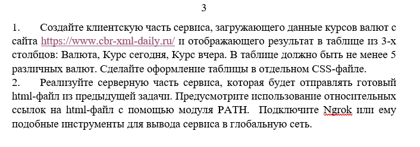

## Запуск 

```
npm ci
```

```
npm start
```
Перед запуском ngrok необходимо  выполнить **`npm start`**. Убедитесь что ваш сервер запускается на 8085 порту. Чтобы запустить ngrok используйте
```
npm run startNgrok
```
Если ngrok запускается впервые, то вы попадете на страницу где вам будет предложено пройти аутентификацию и установить токен авторизации.
Или же вы можете добавить его сами
```
npx ngrok authtoken token
```
Токен можно получить по ссылке https://dashboard.ngrok.com/get-started/setup
## Задание 

